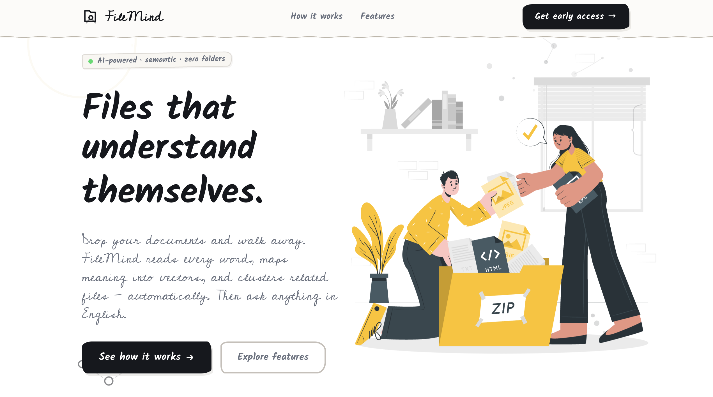

# FileMind: Files that understand themselves 🚀

<div align="center">
  
  
  [](https://react.dev/)
  [](https://vitejs.dev/)
  [](https://fastapi.tiangolo.com/)
  [](https://www.python.org/)
  [](https://supabase.com/)
  [](https://groq.com/)
  [](https://tailwindcss.com/)
  [](https://www.netlify.com/)
  [](https://lucide.dev/)

  ### [**探索 LIVE DEMO →**](https://filemind08.netlify.app/)
</div>

---

FileMind is an AI-powered document intelligence system designed to move beyond traditional folder-based storage. It reads every word, maps meaning into high-dimensional vectors, and clusters your related files automatically. 

Whether you need to search semantically across your entire knowledge base or chat with your documents using RAG (Retrieval-Augmented Generation), FileMind provides a modern, visual, and intelligent workspace.

---

## ✨ Core Features

- 🧠 **Semantic Clustering**: Automatically groups files by topic and meaning, not just filenames.
- 💬 **Knowledge Assistant**: Advanced RAG-based chat that answers questions based on your indexed documents.
- 📊 **Visual Workspace**: Interactive Dendrogram visualization to explore the hierarchy and relationships of your knowledge base.
- 🔍 **Zero Folders**: No more manual sorting. AI understands the context and manages the relationships for you.
- 🔐 **Secure Authentication**: Hybrid login system with Supabase (Email/Password & Google OAuth).
- 🎨 **Artisanal UI**: A clean, "Ink & Sketch" aesthetic with full Dark/Light mode support and fluid animations.
- 📱 **Fully Responsive**: Optimized experience across all devices, from desktop to the smallest mobile screens.

---

## 🛠️ Technology Stack

- **Frontend**: React (Vite) + Tailwind CSS + Lucide Icons
- **Backend**: FastAPI (Python) + Supabase (Auth/DB)
- **AI/ML**: Groq (Llama 3) + Google GenAI (Embeddings)
- **Data**: PyPDF2 / PyMuPDF (PDF Processing) + JSON Vector Store

---

## 📂 Project Structure

```bash
FileMind/
├── frontend/           # React + Vite application
│   ├── src/
│   │   ├── components/ # Branded UI and Dashboard components
│   │   ├── context/    # Auth and Theme state management
│   │   ├── pages/      # Landing, Login, Sign Up, Dashboard
│   └── public/         # Branded assets and favicon
├── backend/            # FastAPI (Python) server
│   ├── ai_engine.py    # LLM and RAG logic
│   ├── cluster_engine.py # Embedding and clustering algorithms
│   ├── main.py         # API Endpoints
└── README.md
```

---

## 🚀 Getting Started

### **1. Clone the repository**
```bash
git clone https://github.com/shashankpalingi/FileMind.git
cd FileMind
```

### **2. Setup Backend**
```bash
cd backend
python -m venv venv
source venv/bin/activate  # Or `venv\Scripts\activate` on Windows
pip install -r requirements.txt
python main.py
```

### **3. Setup Frontend**
```bash
cd frontend
npm install
npm run dev
```

---

### Developed by **Shashank Palingi**
*3rd Year Project — 2026*
